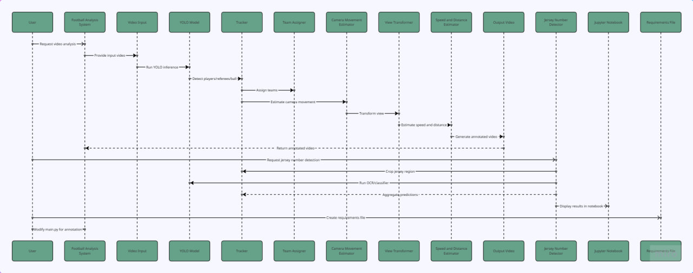

# Football Analysis System

This project is a football match analysis system built using YOLOv8 and computer vision techniques.  
It detects players, referees, and the ball, identifies teams based on colors, and tracks movements across the field.

---

## ⚙️ Requirements

To run this application, make sure you have the following installed:

- Python 3.10 or above
- pip (latest version)
- The following libraries:
  ```bash
  pip install ultralytics supervision 📦 Requirements & Installation

Before starting, make sure you have Conda installed (via Anaconda
 or Miniconda
).

1️⃣ Create a Conda environment

```bash
conda create -n football_analysis python=3.11
```

activate it ..
```bash
conda activate football_analysis
```
2️⃣ Install the required libraries


to install everything at once (recommended for running the full project):


```bash
Copy code
pip install -r requirements.txt
```


## 📓 Model Notebook (Training / Fine-tuning)

This notebook demonstrates how the **YOLOv8 model was fine-tuned** to accurately detect **players, referees, the ball, and goalkeepers** on the football field.

🔗 [**Open Football YOLOv5 Model Notebook (Google Drive)**](https://drive.google.com/drive/folders/1zk8Dbs9FHfxVOY8N28milCaVb83QV31t?usp=drive_link)
It includes:
- Dataset preparation and labeling  
- Model configuration and fine-tuning process  
- Evalu


🎥 Output Videos
Below are three output samples demonstrating the system:

Drive link : 
   🎥 [Sample Video (Google Drive)](<https://drive.google.com/file/d/1k2Qxd9zia1oz50TwX6sha8my_zZY7o-R/view?usp=sharing>)
Video	Description
Output 1	Full match view — detects players and referees


(If GitHub doesn’t show video previews, you can upload short GIFs or screenshots instead.)


🔧 Components & Flow Diagram
Components Overview
YOLOv5 Detector — Detects players, referees, and the ball

Tracker — Keeps consistent IDs across frames

Team Assigner — Differentiates between teams using dominant color clustering

Annotator — Draws detections and adds team and referee labels

Statistics Module — Calculates ball control and distance metrics

Flow Diagram:

📊



🏁 How to Run
Add your input video to the input_videos/ folder

Make sure your YOLO model is saved as models/best.pt

Run:

bash
Copy code
python main.py
Output will be saved to output_videos/ with all detections and tracking results

📈 Notes
The current version detects players, teams, and referees, but the ball label still needs fine-tuning.

What is implemented (current repo)
- Player/referee/ball detection + tracking: implemented via Tracker / YOLO model
- Team color assignment: implemented (team_assigner)
- Camera motion compensation, view transform, speed/distance estimation: implemented
- End-to-end video pipeline: implemented in src/main.py

## 🚧 Next Steps

1. **Jersey Number Recognition** — not yet implemented  
   - Add OCR/CNN module to detect numbers from player crops.  
   - Aggregate per-player results and draw on frames.  


2. **Notebook Deliverable** — `notebooks/jersey_number_detection.ipynb`  
   - Demo detection on sample frames.  
   - Show jersey OCR + aggregated results + visuals.

The system runs frame-by-frame and saves a processed video automatically.

You can modify detection confidence or classes directly in main.py if needed.

👨‍💻 Author
Amr Khalid

AI Engineer — Computer Vision

📍 Cairo, Egypt

🔗 LinkedIn

🔗 GitHub


