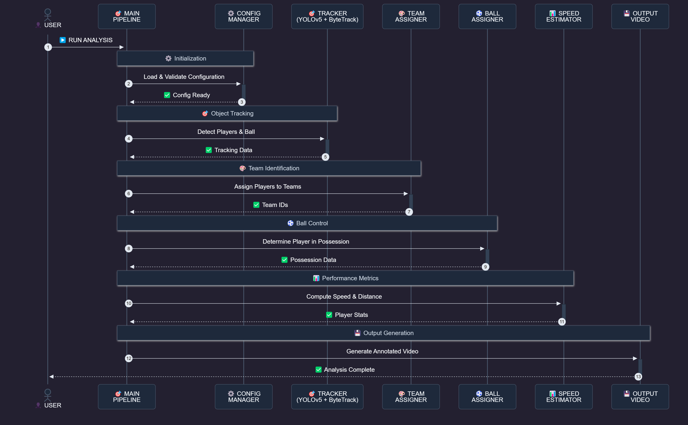

# Football Analysis System


A comprehensive football analysis system built with YOLOv5, ByteTrack, and advanced computer vision techniques for player detection, team assignment, and movement analysis.

## 🚀 Quick Start

```bash
# Install dependencies
pip install -r requirements.txt

# Download model
# Place best.pt in models/ directory

# Run analysis
python main.py
```

## 📚 Documentation

### 📖 User Guide
Complete setup instructions, installation guide, and usage examples for getting started with the system.

👉 **[View User Guide](docs/USER_GUIDE.md)**

### 🔧 Technical Reference  
Comprehensive API documentation covering all modules, functions, classes, and their detailed usage with code examples.

👉 **[View API Documentation](docs/API_DOCS.md)**

### 🏗️ System Architecture
Detailed system architecture, design patterns, component interactions, and data flow diagrams.

👉 **[View Architecture](docs/ARCHITECTURE.md)**

## 🎯 Features

- ✅ **YOLOv5 Detection**: Advanced player, referee, and ball detection
- ✅ **ByteTrack Tracking**: Consistent object tracking across frames
- ✅ **Team Assignment**: K-Means clustering for team color differentiation
- ✅ **Camera Motion**: Lucas-Kanade optical flow for motion compensation
- ✅ **Speed Analysis**: Exponential smoothing for smooth speed measurements
- ✅ **Ball Control**: Proximity-based ball assignment to players
- ✅ **View Transformation**: Coordinate system conversions
- ✅ **Modular Design**: Component-based architecture with clean interfaces

## 📊 System Flow

### Sequence Diagram

The following diagram shows the complete processing flow of the Football Analysis System:



## 🏁 Quick Run

1. Add your input video to `input_videos/` folder
2. Ensure YOLOv5 model is saved as `models/best.pt`
3. Run: `python main.py`
4. Output saved to `output_videos/` with all detections and tracking

## 🎥 Enhanced Output Demo

Check out the enhanced output with all improvements and optimizations:

🎥 **[Enhanced Output Video](https://drive.google.com/file/d/1fcuZMbf07YP7Rkro5sgi_cSQtp6wlX8D/view?usp=drive_link)** - Complete analysis with all enhancements applied

## 👨‍💻 Author

**Amr Khalid** - AI Engineer & Computer Vision Specialist

📍 Cairo, Egypt

🔗 [](https://www.linkedin.com/in/amr-khalid-23a86b1a3/)

💻 [](https://github.com/AMR-khalid441)